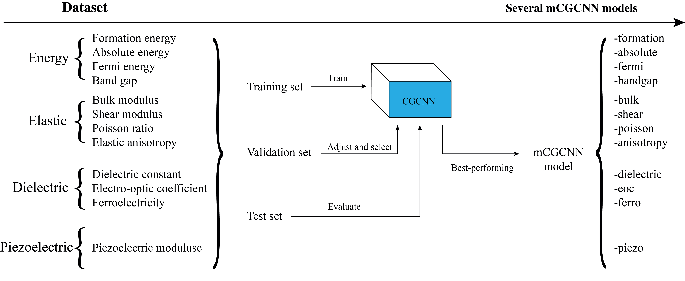
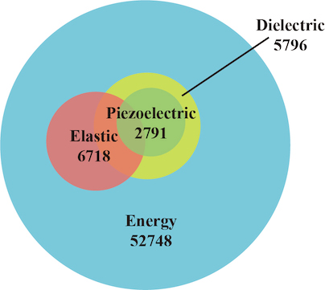

# Crystal Graph Convolutional Neural Networks

This project details the development and optimisation of the CGCNN model, predicts various thermodynamic, mechanical, and electrochemical properties of inorganic materials, and evaluates mCGCNN models’ performances. 

## Members

- [Yiteng Zhou](https://github.com/YitengZhou) (ku19857@bristol.ac.uk)

## Datasets

### [Energy dataset](dissertation/datasets/energy) - formation, absolute, fermi, bandgap

### [Elastic dataset](dissertation/datasets/elastic/readme.md) - bulk, shear modulus, Poisson ratio, elastic anisotropy

### [Dielectric dataset](dissertation/datasets/dielectric/readme.md) - dielectric constant, electro-optic coefficient, ferroelectricity

### [Piezoelectric dataset](dissertation/datasets/piezoelectric/readme.md) - piezoelectric modulus
